# Cross-surface prototype audit

Date: 2026-07-31

## Verdict

The information hierarchy is coherent and the no-fake-data language is strong,
but the prototype is not yet acceptable as visually and accessibly validated.
Four blocking defects remain: browse detail truth during unavailable list
states, text contrast, Control Center reflow, and duplicate title IDs. Human
acceptance of the hierarchy is also pending.

## Scope

- Compra Agil, Licitaciones, and Centro de Control isolated Storybook stories.
- Desktop 1440px and mobile 390px.
- Light and dark CSS theme classes.
- Loading, empty, error, source-pending, missing-value, and partial responses.
- Keyboard-only selection, investigation switching, technical disclosure, and
  `hasMore` pagination.
- Semantic snapshots, document overflow checks, 200% equivalent reflow, and
  `prefers-reduced-motion: reduce`.
- Native Twenty table and record-table stories as density references.

The local Storybook server and Chromium Playwright runner were used because the
integrated Codex Browser was unavailable and the user explicitly authorized
local Playwright.

## Flow steps

### 1. Compra Agil desktop, light — healthy with one state-risk

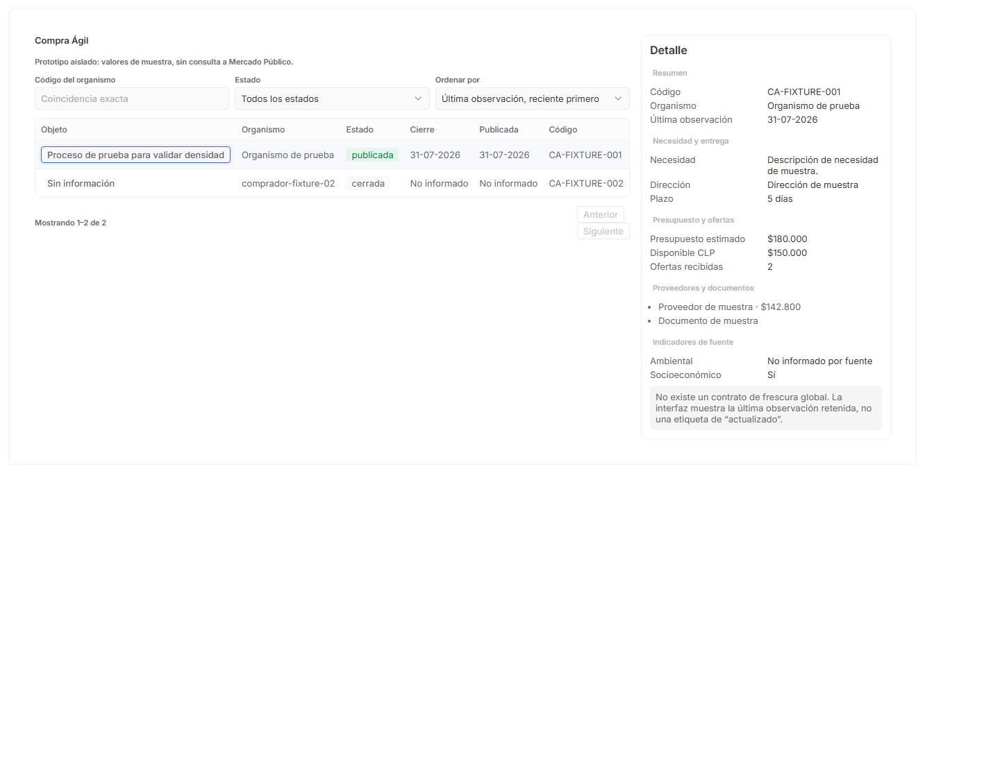

The browse/detail split is clear, filter order is predictable, selection is
visible, and unsupported freshness is explicitly rejected. The table and
detail use native Twenty spacing, border, typography, controls, and status
treatments. The detail is too eager during loading/empty/error; see step 7.

### 2. Licitaciones desktop, light — healthy hierarchy, dense content

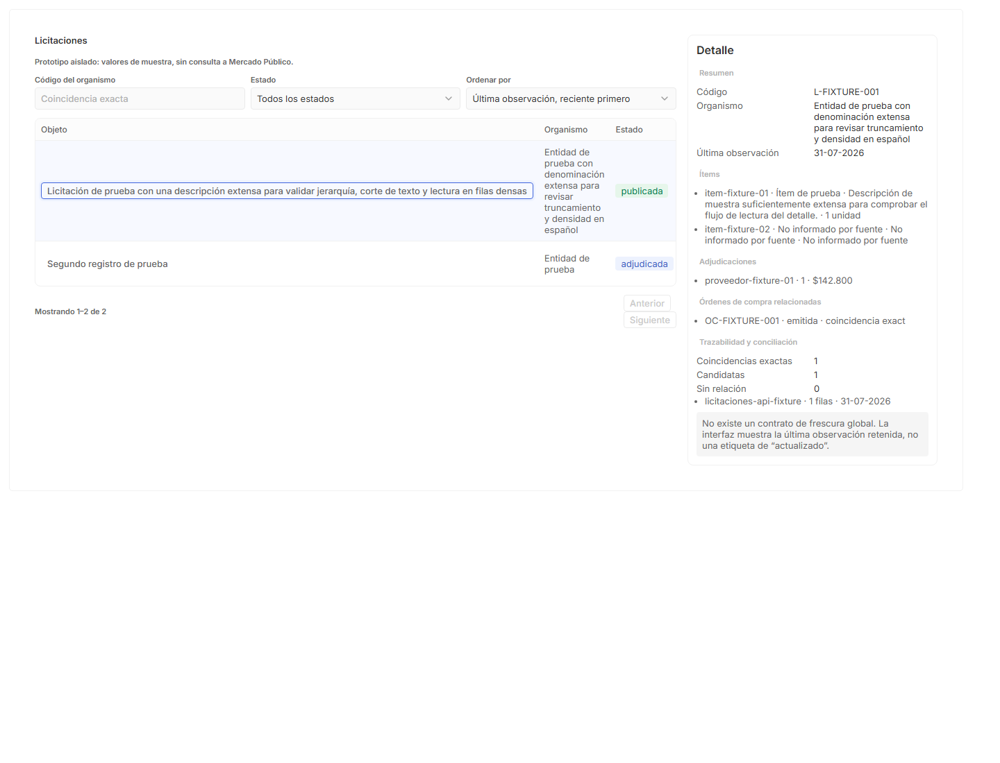

The same grammar transfers without inventing Compra Agil enrichment. Long
titles and buyer names stress the six-column table as intended. The detail is
readable but long; progressive groups keep its order understandable.

### 3. Centro de Control desktop, light — healthy hierarchy

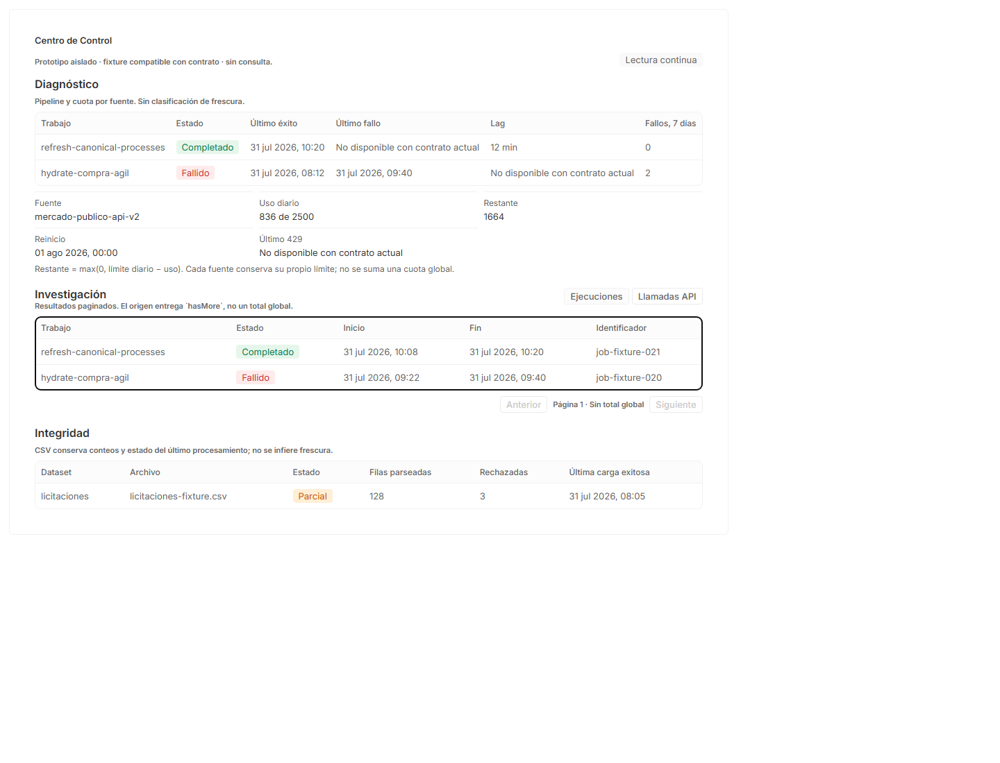

Diagnostico, Investigacion, and Integridad read as one operational narrative.
Quota arithmetic is disclosed, unavailable facts remain unavailable, and one
heavy investigation table is shown at a time.

### 4. Browse mobile, light — usable with contained table scrolling

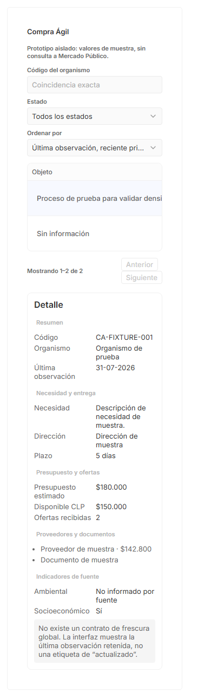

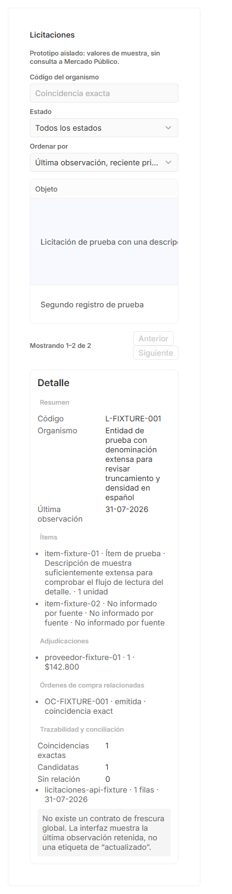

Filters stack, the detail follows the browse surface, and the document itself
does not overflow. The six-column table scrolls inside its bordered container.

### 5. Centro de Control mobile — blocking reflow failure

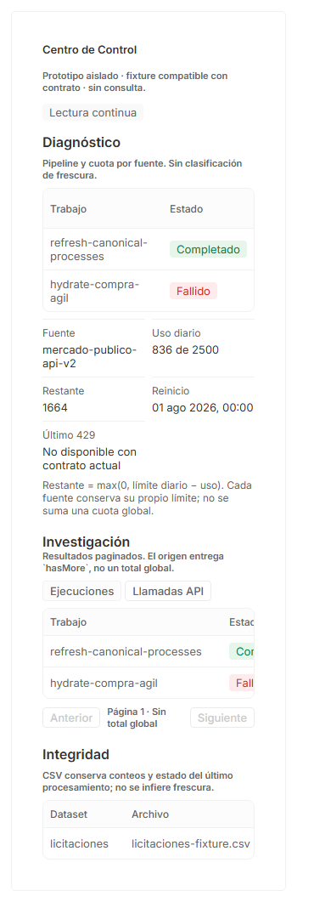

At a 390px viewport the document expands to 788px. Tables and section headings
escape the viewport rather than remaining inside local horizontal scrollers.

### 6. Dark theme — blocking list contrast failure

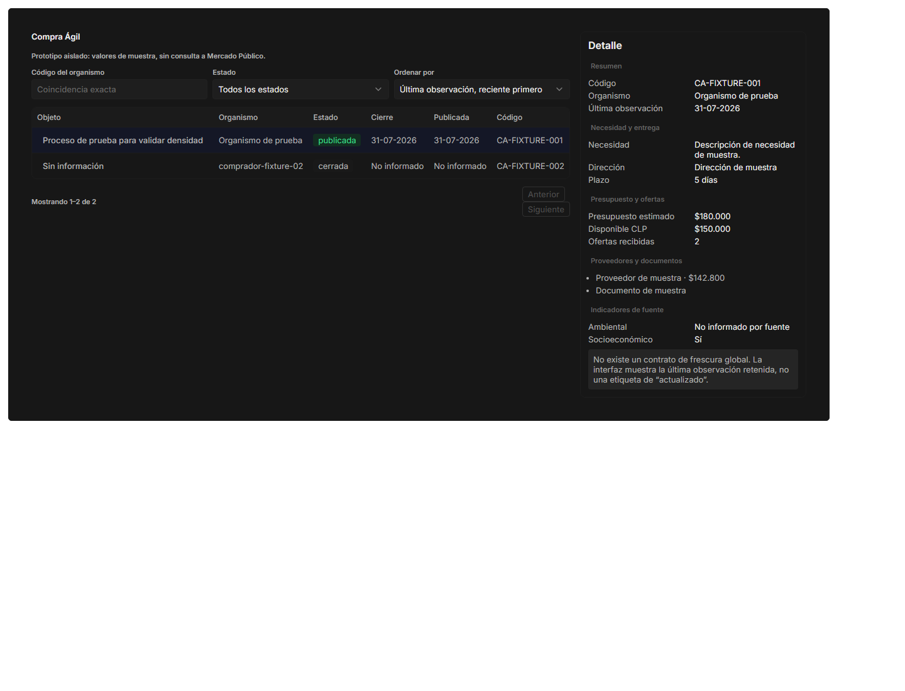

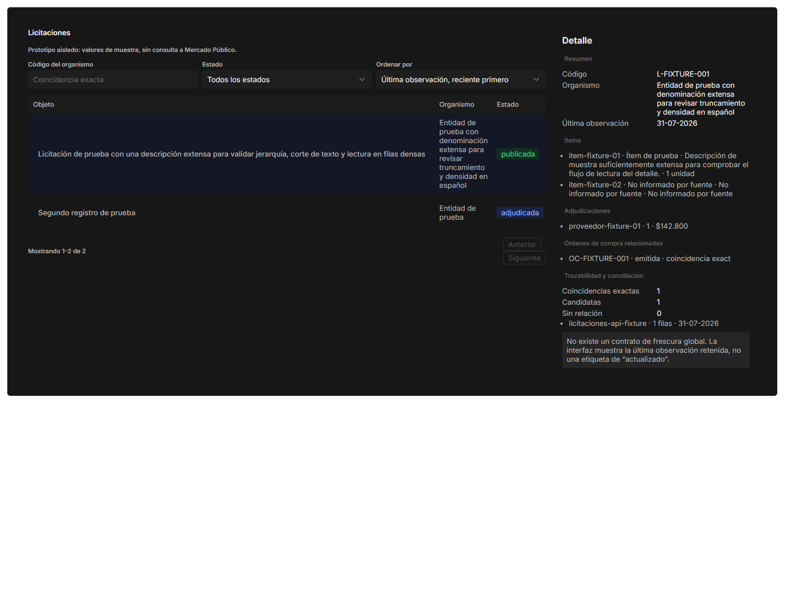

Detail list items inherit browser-default black. Measured contrast is 1.17:1
against the dark primary background. Compra Agil supplier/document text and all
rich Licitaciones evidence lists are effectively unreadable. Native tertiary
metadata also measures below 4.5:1 in both themes and requires a scoped
accessible treatment; disabled controls are excluded from that requirement.

### 7. Loading, empty, error, pending, and partial — mixed

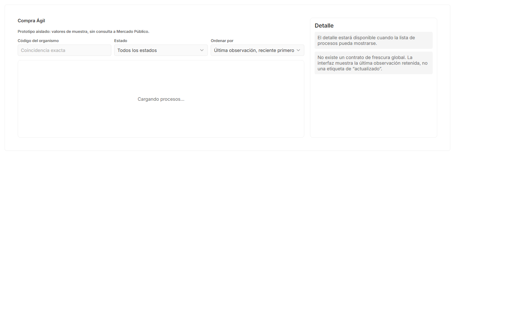

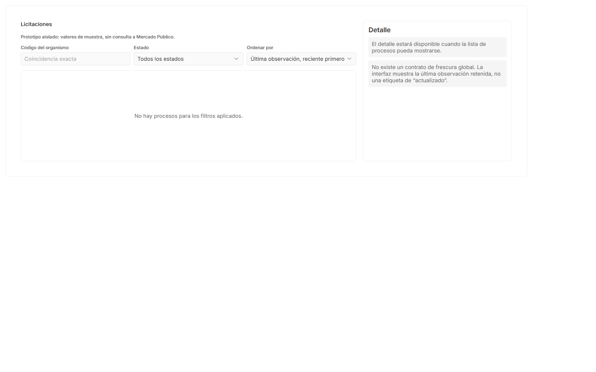

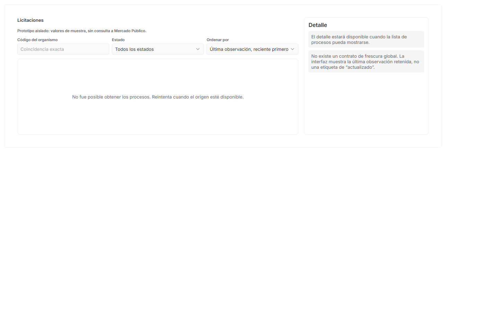

Loading, empty, and error list states still present a fully populated fixture
detail as if it were current. That contradicts the visible list state and is a
data-truth failure. Source-pending, missing values, Control Center partial,
Control Center empty, and Control Center error are explicit and do not replace
missing facts with zero.

### 8. Keyboard interaction — healthy in the isolated prototype

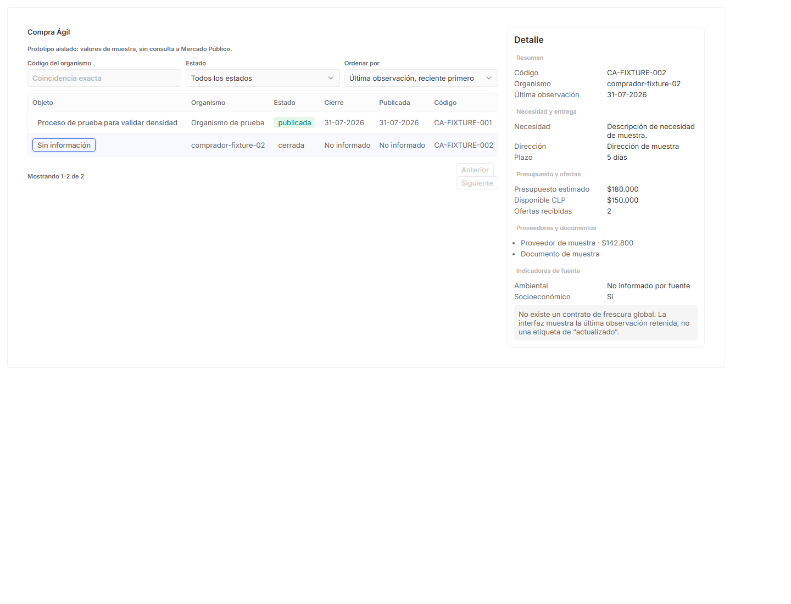

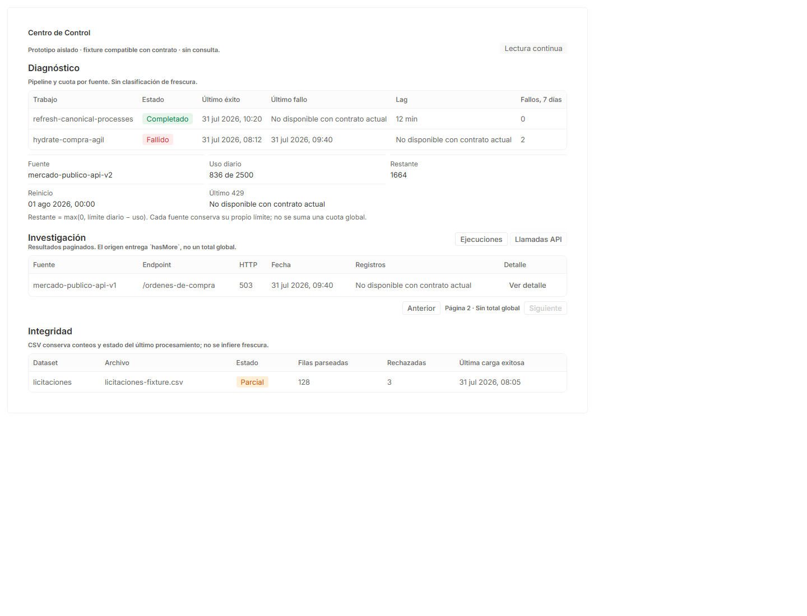

Tab order reaches all visible controls. Enter changes the selected process,
switches to API calls, discloses server-redacted parameters, and advances to
page 2 while retaining the `Sin total global` language. Focus remains on the
activated control. Production SidePanel focus return is not exercised because
this prototype renders detail inline.

### 9. 200% equivalent reflow — browse passes, Control Center fails

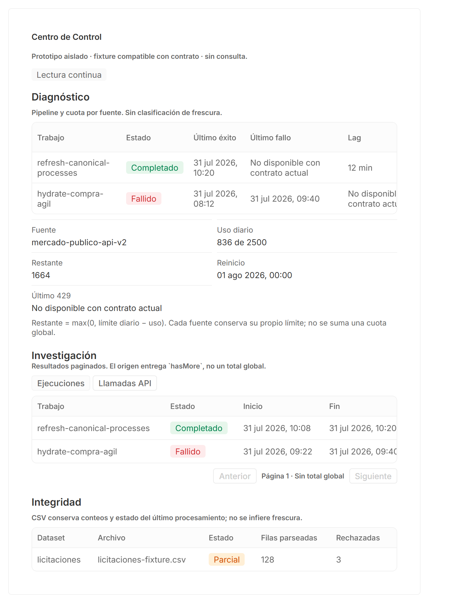

Compra Agil and Licitaciones remain document-contained at a 720 CSS-pixel
viewport with device scale factor 2. Centro de Control again expands from 720px
to 788px, confirming the same containment defect rather than a screenshot crop.

### 10. Semantics and reduced motion — strong base, one ID defect

The accepted semantic snapshots expose labelled browse regions, a complementary
detail landmark, a Control Center banner/main structure, scoped table headers,
definition terms, lists, alerts, and live regions. No page or console errors
occurred across the 17 primary state captures.

Every story with multiple Twenty title components repeats
`title-id-1710235800000`. The shared title implementation derives IDs from the
mocked current time, so frozen Storybook time creates duplicate associations.
The reduced-motion media query matched. The prototype defines no meaningful
animation; remaining transitions come from native controls/Storybook scaffolding.

## No-fake-data review

- Pass: fixture status is disclosed at the top of every loaded surface.
- Pass: `lastSeenAt` is called an observation, never a freshness verdict.
- Pass: quota remaining shows its exact formula and remains source-scoped.
- Pass: partial and unavailable facts are described, not converted to zero.
- Pass: API parameters are server-redacted and pagination preserves `hasMore`
  semantics without claiming a total.
- Fail: the populated browse detail shown beside loading/empty/error can be
  mistaken for current evidence and must be suppressed or explicitly marked as
  retained context.

## Native Twenty comparison

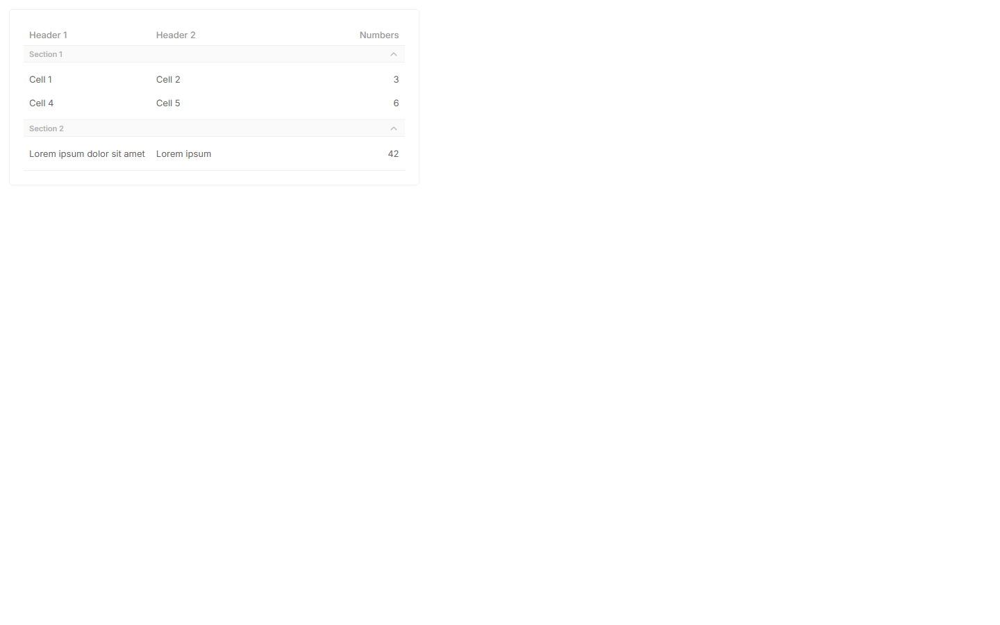

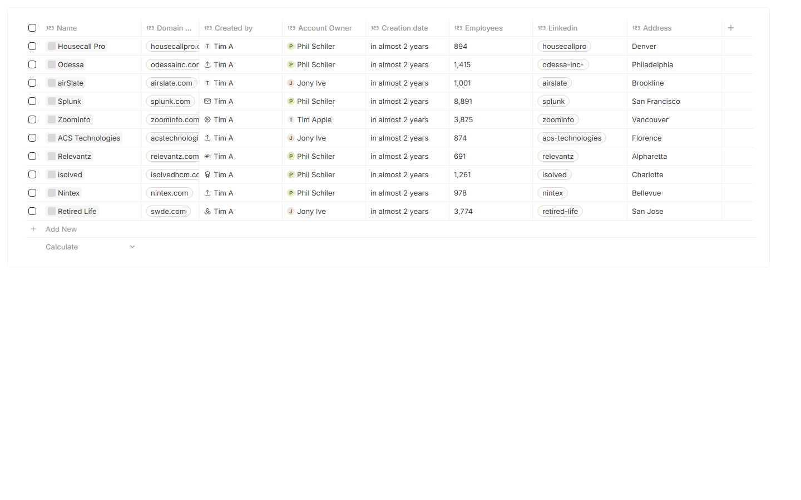

The prototype matches Twenty's light borders, compact typography, subtle
section backgrounds, control scale, and restrained status color. Its shallow
domain table is intentionally more padded than the production record grid and
close to the generic native table story. No new component library or token
family is justified.

## Blocking follow-ups

1. [Restore truthful browse state/detail coupling](../../issues/11-truthful-browse-state-detail.md).
2. [Meet accessible text contrast in both themes](../../issues/12-accessible-text-contrast.md).
3. [Contain Control Center at mobile and 200% zoom](../../issues/13-control-center-responsive-containment.md).
4. [Eliminate duplicate title IDs](../../issues/14-unique-title-ids.md).

## Evidence limits

- Dark mode was applied through the canonical root `.dark` class because the
  Storybook preview hard-codes a light `ThemeProvider`; CSS-variable rendering
  is verified, but context consumers were not switched to dark.
- Screen-reader structure was inspected through Playwright ARIA snapshots, not
  with a human NVDA/JAWS/VoiceOver session.
- The inline prototype cannot prove production SidePanel focus trapping or
  focus return.
- The screenshots prove the fixture states and UI behavior, not backend data
  correctness or production integration.

## Artifacts

- `results.json` contains DOM, keyboard, contrast, overflow, interaction,
  reduced-motion, and error evidence.
- `01` through `25` PNG files are the accepted current-run screenshots.
- `01` through `17` ARIA YAML files are the accepted semantic snapshots.
- `audit.mjs` and `capture-references.mjs` reproduce the local checks while a
  modules-scoped Storybook server is running on port 6006.

## Fresh replay — 2026-07-31 15:48 CLT

This replay supersedes the historical blocking verdict above. It produced 25
screenshots and 17 ARIA snapshots after the four follow-ups were resolved.

- All 20 DOM snapshots: `duplicateIds: []`.
- Document overflow: zero findings at desktop, 390px mobile, and 200% proxy.
- Normal-text contrast below 4.5:1: zero findings in light or dark captures.
- Page errors: zero across 17 primary state captures.
- Keyboard browse selection, Control Center API pagination, and reduced motion
  pass. The user already accepted hierarchy and information priority.

Verdict: prototype passes the non-production visual, interaction,
accessibility, theme, and no-fake-data gate. The listed follow-ups are
resolved, not remaining blockers.
