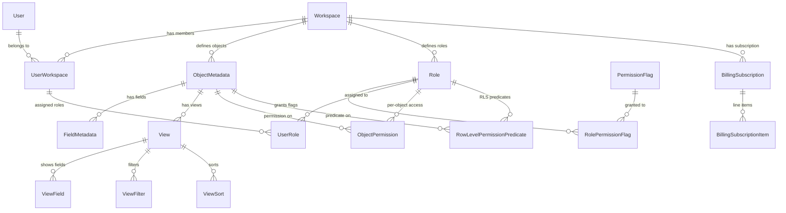

# Data Model

## Purpose
Define the canonical data model for the Twenty CRM platform. This document covers the multi-tenant architecture, core entities, metadata entities, the metadata-driven schema system, field types, and the instance command migration pattern.

## Primary Audience
AI agents, engineers, and architects working on the Twenty backend.

## Executive Summary
Twenty uses a metadata-driven data model: object and field definitions stored in database tables dynamically generate PostgreSQL schemas at runtime via TwentyORM. Multi-tenancy is achieved through per-workspace PostgreSQL schema isolation (`workspace_<id>`). Core infrastructure entities (workspaces, users) live in the `core` schema. Metadata definitions (objects, fields, views, roles) live in a metadata schema. CRM data lives in per-tenant workspace schemas whose shapes are determined by metadata.

## Multi-Tenant Architecture

Twenty isolates tenant data using PostgreSQL schemas:

| Schema | Purpose | Contents |
| --- | --- | --- |
| `core` | Shared infrastructure | Workspace, User, UserWorkspace, BillingSubscription, AppToken, SigningKey |
| `metadata` | Workspace-scoped definitions | ObjectMetadata, FieldMetadata, View, Role, PermissionFlag, PageLayout |
| `workspace_<id>` | Tenant CRM data | Companies, Contacts, Deals, Tasks, Notes, custom objects. Shape is dynamic. |

**Key design**: Each request resolves the workspace from the auth context, then TwentyORM creates or fetches a per-workspace TypeORM DataSource connected to the `workspace_<id>` schema. Entity schemas are compiled at runtime from ObjectMetadata and FieldMetadata definitions.

## Entity Inheritance Hierarchy

```
WorkspaceRelatedEntity
  ├── workspaceId: string
  └── workspace: WorkspaceEntity
      │
      └── SyncableEntity
            ├── universalIdentifier: string
            └── applicationId: string
                │
                └── OverridableEntity<T>
                      ├── overrides: T (jsonb)
                      └── isActive: boolean

BaseWorkspaceEntity
  ├── id: string
  ├── createdAt: string
  ├── updatedAt: string
  └── deletedAt: string | null
```

- **WorkspaceRelatedEntity**: Core entities that belong to a workspace (Users, Billing, etc.)
- **SyncableEntity**: Extends WorkspaceRelatedEntity with app-syncing fields
- **OverridableEntity<T>**: Extends SyncableEntity with override/activation support. Used for Views, PageLayouts, CommandMenuItems.
- **BaseWorkspaceEntity**: Base for workspace data entities (companies, deals). Schema generated dynamically from metadata.

## Core Entities

### WorkspaceEntity
**Schema**: `core`, **Table**: `workspace`

| Field | Type | Notes |
| --- | --- | --- |
| `id` | uuid (PK) | |
| `displayName` | string? | |
| `activationStatus` | enum | PENDING_CREATION / ONGOING_CREATION / ACTIVE / INACTIVE / SUSPENDED |
| `subdomain` | varchar (unique) | |
| `customDomain` | varchar? (unique) | |
| `databaseSchema` | varchar? | PostgreSQL schema name for workspace data |
| `metadataVersion` | number | Tracks metadata schema version |
| `allowImpersonation` | boolean | Default true |
| `isPublicInviteLinkEnabled` | boolean | Default true |
| `isGoogleAuthEnabled` | boolean | Default true |
| `isMicrosoftAuthEnabled` | boolean | Default true |
| `isPasswordAuthEnabled` | boolean | Default true |
| `isTwoFactorAuthenticationEnforced` | boolean | Default false |
| `defaultRoleId` | uuid? | FK → RoleEntity |
| `fastModel` | varchar | AI fast model ID |
| `smartModel` | varchar | AI smart model ID |
| `trashRetentionDays` | integer | Default 14 |
| `eventLogRetentionDays` | integer | Default 90 |
| `deletedAt` | timestamptz? | Soft-delete |

### UserEntity
**Schema**: `core`, **Table**: `user`

| Field | Type | Notes |
| --- | --- | --- |
| `id` | uuid (PK) | |
| `email` | string | Lowered via `@BeforeInsert/@BeforeUpdate`. Unique where `deletedAt IS NULL` |
| `firstName` | string | Default `''` |
| `lastName` | string | Default `''` |
| `passwordHash` | string? | Bcrypt. Not exposed via GraphQL |
| `isEmailVerified` | boolean | Default false |
| `disabled` | boolean | Default false |
| `canImpersonate` | boolean | Server-level impersonation ability |
| `canAccessFullAdminPanel` | boolean | Admin panel access |
| `locale` | varchar | I18n locale |
| `deletedAt` | timestamptz? | Soft-delete |

### UserWorkspaceEntity
**Schema**: `core`, **Table**: `userWorkspace`

| Field | Type | Notes |
| --- | --- | --- |
| `id` | uuid (PK) | |
| `userId` | uuid | FK → UserEntity (CASCADE) |
| `workspaceId` | uuid | Inherited from WorkspaceRelatedEntity |
| `locale` | varchar | |
| `deletedAt` | timestamptz? | Soft-delete |

Unique index: `(userId, workspaceId)` where `deletedAt IS NULL`.

**Virtual fields** (loaded at query time): `permissionFlags`, `objectPermissions`.

## Metadata Entities

### ObjectMetadataEntity
**Schema**: metadata, **Table**: `objectMetadata`

Defines a database object (table) in the workspace. Extends `SyncableEntity`.

| Field | Type | Notes |
| --- | --- | --- |
| `id` | uuid (PK) | |
| `nameSingular` | string | e.g. `"company"`. Unique per workspace. |
| `namePlural` | string | e.g. `"companies"`. Unique per workspace. |
| `labelSingular` | string | Display label. e.g. `"Company"` |
| `labelPlural` | string | Display label. e.g. `"Companies"` |
| `description` | text? | |
| `icon` | varchar? | Tabler icon name |
| `isActive` | boolean | Default false |
| `isSystem` | boolean | Core system objects |
| `isRemote` | boolean | External data source objects |
| `isAuditLogged` | boolean | Default true |
| `isSearchable` | boolean | Default false |
| `labelIdentifierFieldMetadataId` | uuid? | FK → field used as record label |
| `imageIdentifierFieldMetadataId` | uuid? | FK → field used as record image |
| `shortcut` | varchar? | Keyboard shortcut |
| `duplicateCriteria` | jsonb? | Fields used for duplicate detection |

**Relations**: `fields` (FieldMetadataEntity[]), `views` (ViewEntity[]), `objectPermissions`, `fieldPermissions`.

### FieldMetadataEntity
**Schema**: metadata, **Table**: `fieldMetadata`

Defines a field (column) on an object. Extends `SyncableEntity`. Generic over `FieldMetadataType`.

| Field | Type | Notes |
| --- | --- | --- |
| `id` | uuid (PK) | |
| `objectMetadataId` | uuid | FK → ObjectMetadataEntity (CASCADE) |
| `type` | varchar | FieldMetadataType enum value |
| `name` | string | Field name. Unique per `(name, objectMetadataId, workspaceId)` |
| `label` | string | Display label |
| `description` | text? | |
| `icon` | varchar? | |
| `defaultValue` | jsonb? | Type-specific default |
| `options` | jsonb? | Enum options for SELECT/MULTI_SELECT |
| `settings` | jsonb? | Type-specific settings (relation type, etc.) |
| `isActive` | boolean | Default false |
| `isSystem` | boolean | Core system fields |
| `isNullable` | boolean? | Default true |
| `relationTargetFieldMetadataId` | uuid? | FK → FieldMetadataEntity. Only for RELATION/MORPH_RELATION types |
| `relationTargetObjectMetadataId` | uuid? | FK → ObjectMetadataEntity. Only for RELATION/MORPH_RELATION types |
| `morphId` | uuid? | Only for MORPH_RELATION type |

### ViewEntity
**Schema**: metadata, **Table**: `view`

Defines a saved view on an object. Extends `OverridableEntity<ViewOverrides>`.

| Field | Type | Notes |
| --- | --- | --- |
| `id` | uuid (PK) | |
| `name` | text | |
| `objectMetadataId` | uuid | FK → ObjectMetadataEntity (CASCADE) |
| `type` | enum (ViewType) | TABLE / KANBAN / CALENDAR / TABLE_WIDGET |
| `key` | enum (ViewKey)? | INDEX (default view) |
| `position` | double | Display order. Default 0. |
| `isCompact` | boolean | Default false |
| `openRecordIn` | enum | SIDE_PANEL / RECORD_PAGE |
| `kanbanAggregateOperation` | enum? | Aggregate operation for kanban columns |
| `kanbanAggregateOperationFieldMetadataId` | uuid? | FK → FieldMetadataEntity |
| `calendarLayout` | enum? | Calendar display layout |
| `calendarFieldMetadataId` | uuid? | FK → FieldMetadataEntity |
| `visibility` | enum | WORKSPACE / UNLISTED |

### RoleEntity
**Schema**: metadata, **Table**: `role`

Defines a permission role. Extends `SyncableEntity`.

| Field | Type | Notes |
| --- | --- | --- |
| `id` | uuid (PK) | |
| `label` | string | Unique per workspace |
| `canUpdateAllSettings` | boolean | Super-admin for settings |
| `canAccessAllTools` | boolean | Super-admin for tools |
| `canReadAllObjectRecords` | boolean | Global read access |
| `canUpdateAllObjectRecords` | boolean | Global write access |
| `canSoftDeleteAllObjectRecords` | boolean | Global soft-delete |
| `canDestroyAllObjectRecords` | boolean | Global hard-delete |
| `isEditable` | boolean | Default true |
| `canBeAssignedToUsers` | boolean | Default true |
| `canBeAssignedToAgents` | boolean | Default true |
| `canBeAssignedToApiKeys` | boolean | Default true |

### PermissionFlagEntity
**Schema**: metadata, **Table**: `permissionFlag`

Defines a granular permission. Extends `SyncableEntity`.

| Field | Type | Notes |
| --- | --- | --- |
| `id` | uuid (PK) | |
| `key` | varchar | Unique per workspace. e.g. `"WORKSPACE"`, `"SECURITY"` |
| `label` | varchar | Display label |
| `permissionType` | varchar | `settings` or `tool` |

## Entity Relationship Diagram



## Metadata-Driven Schema Generation

TwentyORM dynamically generates PostgreSQL schemas from metadata at runtime:

### Schema Resolution Flow

```
1. Request arrives → Auth middleware resolves workspace
2. TwentyORM resolves or creates per-workspace TypeORM DataSource
3. EntitySchemaFactory assembles entity schemas:
   a. EntitySchemaColumnFactory maps FieldMetadataType → PostgreSQL column types
   b. For composite types (ADDRESS, CURRENCY, LINKS, PHONES, EMAILS, FULL_NAME):
      explode into multiple sub-columns (e.g., addressStreet, addressCity, ...)
   c. For RELATION/MORPH_RELATION types (ManyToOne):
      create uuid join columns (e.g., companyId)
   d. EntitySchemaRelationFactory resolves one-to-many/many-to-many relations
4. WorkspaceSchemaManager manages DDL:
   a. WorkspaceSchemaTableManagerService — CREATE/DROP/ALTER/RENAME tables
   b. WorkspaceSchemaColumnManagerService — ADD/DROP/ALTER columns
   c. WorkspaceSchemaIndexManagerService — CREATE/DROP indexes
   d. WorkspaceSchemaEnumManagerService — CREATE/DROP enum types
   e. WorkspaceSchemaForeignKeyManagerService — ADD/DROP foreign keys
5. All DDL operates via raw SQL (QueryRunner.query())
```

### Column Type Mapping

| FieldMetadataType | PostgreSQL Type |
| --- | --- |
| UUID | uuid |
| TEXT, RICH_TEXT | text |
| BOOLEAN | boolean |
| NUMBER | double precision |
| NUMERIC | numeric |
| DATE | date |
| DATE_TIME | timestamptz |
| SELECT | varchar |
| MULTI_SELECT | varchar[] |
| RATING | integer |
| POSITION | double precision |
| RAW_JSON | jsonb |
| ARRAY | jsonb |
| TS_VECTOR | tsvector |
| RELATION (ManyToOne) | uuid (join column) |
| MORPH_RELATION | uuid (join column) |
| ACTOR | uuid |
| FILES | uuid |
| ADDRESS | Composite: addressStreet, addressCity, addressPostalCode, addressState, addressCountry |
| CURRENCY | Composite: amount, currencyCode |
| LINKS | Composite: primaryLinkLabel, primaryLinkUrl, secondaryLinks (jsonb) |
| PHONES | Composite: primaryPhoneNumber, additionalPhones (jsonb) |
| EMAILS | Composite: primaryEmail, additionalEmails (jsonb) |
| FULL_NAME | Composite: firstName, lastName |

## WorkspaceEntityManager

The `WorkspaceEntityManager` (1844 lines) overrides standard TypeORM operations to add:

| Feature | Description |
| --- | --- |
| **Permission enforcement** | Validates operations are permitted before execution (`validateOperationIsPermittedOrThrow`) |
| **Row-level security** | Injects RLS predicates into queries based on user roles |
| **Nested relation handling** | Connect/disconnect relations via `RelationNestedQueries` |
| **File synchronization** | Syncs file fields with storage backend (`FilesFieldSync`) |
| **Event emission** | Emits events on mutations for hooks and workflow triggers |
| **Upgrade-aware proxying** | Blocks writes during metadata upgrades |

## Instance Commands (Database Migrations)

Database changes are managed through a custom migration system:

### Fast Instance Commands
- Schema-only changes (column additions, table creation)
- Implement `FastInstanceCommand { up(queryRunner), down(queryRunner) }`
- Both `up` and `down` must be idempotent (`IF EXISTS` / `IF NOT EXISTS`)
- Operate via raw SQL through TypeORM `QueryRunner`

### Slow Instance Commands
- Schema changes + data migration
- Extend `FastInstanceCommand` with `runDataMigration(dataSource: DataSource)`
- `runDataMigration` receives a full `DataSource` with access to all repositories
- Executed after fast instance commands complete
- Used for data backfills, transformations, and migrations that touch existing data

### Registration & Execution
```typescript
@RegisteredInstanceCommand('2.15.0', 1781600000000)
export class AddFieldFastInstanceCommand implements FastInstanceCommand { ... }

@RegisteredInstanceCommand('2.14.0', 1781515653781, { type: 'slow' })
export class DataMigrationSlowInstanceCommand implements SlowInstanceCommand { ... }
```

- Decorator: `@RegisteredInstanceCommand(version, timestamp, options?)`
- Discovery: `UpgradeSequenceReaderService` reads all registered commands
- Execution: `UpgradeSequenceRunnerService` runs fast commands first, then slow commands
- Commands are immutable once committed — never delete or rewrite
- Generate with: `npx nx run twenty-server:database:migrate:generate --name <name> --type <fast|slow>`

## FieldMetadataType Catalog

Twenty supports 27 field types via `FieldMetadataType` enum in `twenty-shared`:

| Type | PostgreSQL Mapping | Notes |
| --- | --- | --- |
| `TEXT` | text | Single-line text |
| `RICH_TEXT` | text | Blocks-based rich text (TipTap) |
| `BOOLEAN` | boolean | |
| `NUMBER` | double precision | Floating point |
| `NUMERIC` | numeric | Fixed-precision decimal |
| `DATE` | date | |
| `DATE_TIME` | timestamptz | |
| `SELECT` | varchar | Single enum value. Options in `FieldMetadataOptions` |
| `MULTI_SELECT` | varchar[] | Array of enum values |
| `RATING` | integer | Star rating |
| `POSITION` | double precision | Sortable position |
| `UUID` | uuid | Universal identifier |
| `RAW_JSON` | jsonb | Unstructured JSON |
| `ARRAY` | jsonb | |
| `TS_VECTOR` | tsvector | Full-text search vector |
| `RELATION` | uuid (join column) | Foreign key relation to another object |
| `MORPH_RELATION` | uuid (join column) | Polymorphic relation |
| `ACTOR` | uuid | References a user/actor |
| `FILES` | uuid | File attachment |
| `ADDRESS` | Composite (5 columns) | street, city, postalCode, state, country |
| `CURRENCY` | Composite (2 columns) | amount + currency code |
| `LINKS` | Composite (3 columns) | primaryLinkLabel, primaryLinkUrl, secondaryLinks |
| `PHONES` | Composite (2 columns) | primaryPhoneNumber, additionalPhones |
| `EMAILS` | Composite (2 columns) | primaryEmail, additionalEmails |
| `FULL_NAME` | Composite (2 columns) | firstName, lastName |

## Current Assumptions

- PostgreSQL per-workspace schema isolation remains the multi-tenant strategy.
- Metadata-driven schema generation at runtime is the long-term design; static schemas are not planned.
- TypeORM with the custom TwentyORM layer remains the ORM stack.
- Instance commands are immutable once committed.
- Field types are extensible but the current 27 types cover the known product scope.

## Open Decisions

- Should there be a maximum number of fields per object enforced at the metadata layer?
- Should composite types be stored as composite PostgreSQL types or remain as exploded columns?
- Should there be a data archival strategy for inactive workspaces?
