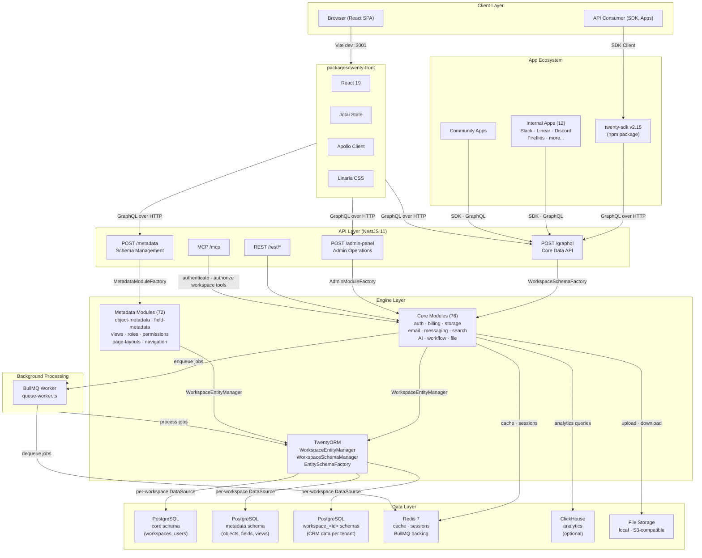

# Reference Architecture

## Purpose
Define the canonical reference architecture for the Twenty CRM platform. This document provides a visual diagram of the system, documents component responsibilities, and defines the integration model between components.

## Primary Audience
AI agents, engineers, architects, and reviewers working on the Twenty codebase.

## Executive Summary
Twenty's architecture follows a layered design: a React 19 SPA frontend communicates with a NestJS 11 backend via GraphQL over HTTP. The backend engine has four layers (API → Core Modules → Metadata Modules → TwentyORM). Data is stored in PostgreSQL 16 with per-workspace schema isolation. Background jobs run via BullMQ backed by Redis 7. Apps extend the platform via a public SDK. This document provides the canonical diagram and integration rules.

## Reference Architecture Diagram



## Component Responsibilities

### Client Layer

| Component | Responsibility |
| --- | --- |
| Browser (React SPA) | Renders the CRM UI. Served by Vite in development, NestJS `ServeStaticModule` in production. |
| API Consumer (SDK, Apps) | Programmatic consumers using `twenty-sdk` or direct GraphQL calls. |

### Frontend (`twenty-front`)

| Component | Responsibility |
| --- | --- |
| React 19 | UI framework. 56 feature modules, 6 route pages. |
| Jotai | Atomic state management. Atoms, selectors, atom families for global state. |
| Apollo Client | GraphQL data fetching. Cache management. Typed hooks from codegen. |
| Linaria | Zero-runtime CSS-in-JS. styled-components API. Theme tokens from `twenty-ui`. |

### API Layer (NestJS 11)

| Endpoint | Responsibility | Schema Generation |
| --- | --- | --- |
| `POST /graphql` | Core data API. CRUD on workspace entities (companies, contacts, deals, custom objects). | `WorkspaceSchemaFactory` generates SDL + resolvers per workspace at runtime. |
| `POST /metadata` | Schema management API. CRUD on object definitions, fields, views, roles, permissions. | `MetadataModuleFactory` generates schema from metadata modules. |
| `POST /admin-panel` | Admin API. Workspace management, feature flags, event logs, billing. | `AdminModuleFactory` generates schema from admin modules. |
| `REST /rest/*` | REST endpoints for specific operations (file upload, webhooks, OAuth callbacks). | Static route definitions. |
| `MCP /mcp` | Authenticated Model Context Protocol endpoint. Resolves workspace-scoped skills and tools after authentication and permission checks. | Static HTTP endpoint; tool availability is resolved at runtime. It is distinct from the developer client configuration in `.mcp.json`. |

### Engine Layer

| Layer | Responsibility | Key Components |
| --- | --- | --- |
| Core Modules (76) | Infrastructure and cross-cutting concerns. Auth, billing, users, workspaces, email, storage, search, AI, workflow. | `CoreEngineModule` aggregates all core modules. |
| Metadata Modules (72) | Schema definition and management. Object and field metadata, views, roles, permissions, layouts, navigation. | `MetadataEngineModule` aggregates all metadata modules. |
| TwentyORM | Custom multi-tenant ORM on TypeORM. Per-workspace DataSource management, dynamic entity schema compilation, workspace-scoped entity manager. | `WorkspaceEntityManager`, `WorkspaceSchemaManager`, `EntitySchemaFactory`. |

### Data Layer

| Component | Responsibility | Details |
| --- | --- | --- |
| PostgreSQL (core schema) | Shared metadata. Workspaces, users, global configuration. | Single schema for all tenants. |
| PostgreSQL (metadata schema) | Workspace-scoped metadata. Object definitions, field definitions, views, roles. | One per workspace, managed by `WorkspaceMetadataVersionModule`. |
| PostgreSQL (workspace schemas) | Tenant CRM data. Companies, contacts, deals, custom objects. | Schema `workspace_<id>`. Dynamic shape from metadata. |
| Redis 7 | Cache and queue backing. Session storage, BullMQ job data. | Memory policy: `noeviction`. |
| BullMQ Worker | Background job processing. Queue consumer in `queue-worker.ts`. | Polls Redis for jobs, processes via TwentyORM. |
| ClickHouse | Analytics database. Event tracking and reporting. | Optional. Enable via configuration. |
| File Storage | File metadata and binary storage. | Local filesystem or S3-compatible. |

### App Ecosystem

| Component | Responsibility | Details |
| --- | --- | --- |
| `twenty-sdk` | Public SDK for building apps. CLI (`twenty`) + library (`define`, `front-component`, `billing`, `logic-function`, `utils`). | Published to npm. Version 2.15.0. |
| Internal Apps | 12 built-in apps: Slack, Linear, Discord, Fireflies, and more. | Managed in `twenty-apps/internal/`. |
| Community Apps | Community-contributed apps. | Managed in `twenty-apps/community/`. |

## Integration Model

### Request Flow (Read)

```
1. Browser → Vite dev server (:3001) or NestJS ServeStaticModule (production)
2. React SPA loads, hydrates metadata store from localStorage
3. User navigates → Apollo Client sends GraphQL query to POST /graphql
4. NestJS middleware: JWT hydrate → workspace context resolution
5. WorkspaceSchemaFactory generates GraphQL schema for the workspace
6. Resolver calls Core/Metadata module service
7. Service uses WorkspaceEntityManager (TwentyORM)
8. TwentyORM resolves per-workspace DataSource → PostgreSQL query
9. Result returns through GraphQL → Apollo cache → React render
```

### Request Flow (Write)

```
1-6. Same as read flow
7. Service calls WorkspaceEntityManager with mutation
8. TwentyORM executes within workspace DataSource transaction
9. Event emitted (WorkspaceEventEmitter) for hooks and workflow triggers
10. If workflow trigger: job enqueued in BullMQ via Redis
11. Worker picks up job, executes logic function
12. Result returns to client
```

### Background Job Flow

```
1. Core module enqueues job in BullMQ → stored in Redis
2. BullMQ Worker (queue-worker.ts) polls Redis for jobs
3. Worker resolves workspace context from job metadata
4. Worker executes job handler via TwentyORM
5. Job result stored (success/failure). Retry if configured.
```

### App Installation Flow

```
1. Developer defines app using twenty-sdk/define functions
2. Developer runs `npx twenty app:publish` → app packaged and sent to server
3. Server processes app definitions: creates objects, fields, views, roles in metadata
4. App appears in workspace navigation and command menu
5. Front-end components render in record pages via twenty-front-component-renderer
```

## Current State Versus Target State

| Component | Current State | Target State |
| --- | --- | --- |
| Frontend | React 19 SPA, Vite-bundled | Stable. Performance optimization. |
| Backend | NestJS 11, GraphQL Yoga | Stable. Potential modularization of engine. |
| Database | PostgreSQL 16, per-workspace schemas | Stable. Connection pooling optimization. |
| Worker | BullMQ single process | Horizontal scaling if needed. |
| Apps | 12 internal, 1 community, 2 examples | Marketplace with discovery and ratings. |
| AI | Agent chat, tool provider, code interpreter | Deeper integration: autonomous actions by risk level. |
| Observability | OpenTelemetry, Sentry, Grafana | Enhanced metrics and alerting. |

## Current Assumptions

- The layered architecture (API → Engine → Data) is stable and will not be fundamentally restructured.
- GraphQL with runtime schema generation remains the primary API protocol.
- PostgreSQL per-workspace schemas remain the multi-tenant isolation strategy.
- BullMQ + Redis remains the job queue for the foreseeable future.
- The app SDK is the primary extensibility mechanism.
- `twenty-docker` is separate infrastructure, not part of the code dependency graph.

## Open Decisions

- Should the frontend and backend be merged into a single NestJS-served application in production, or remain separate deployables?
- Should there be a dedicated API gateway or reverse proxy (e.g., Caddy, Nginx) in the reference architecture?
- Should ClickHouse become a required component or remain optional?
